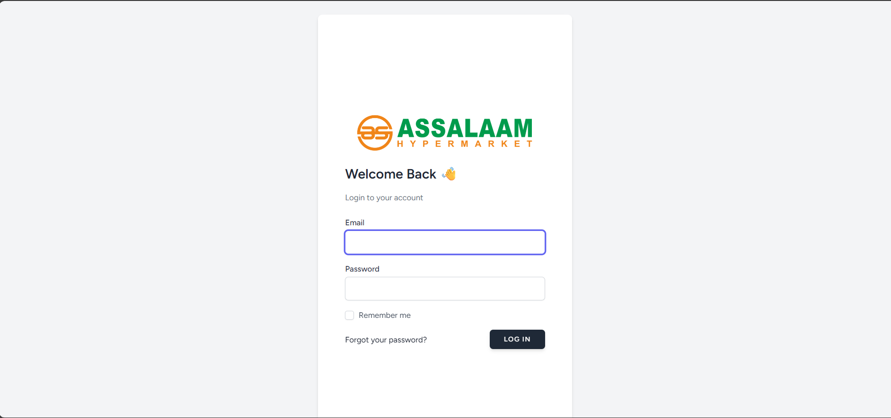
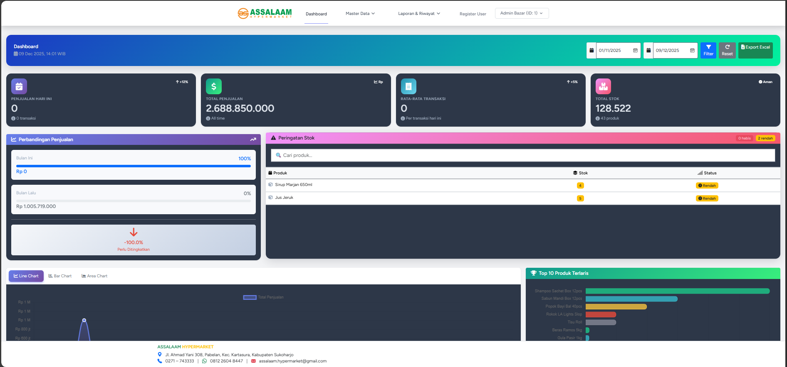
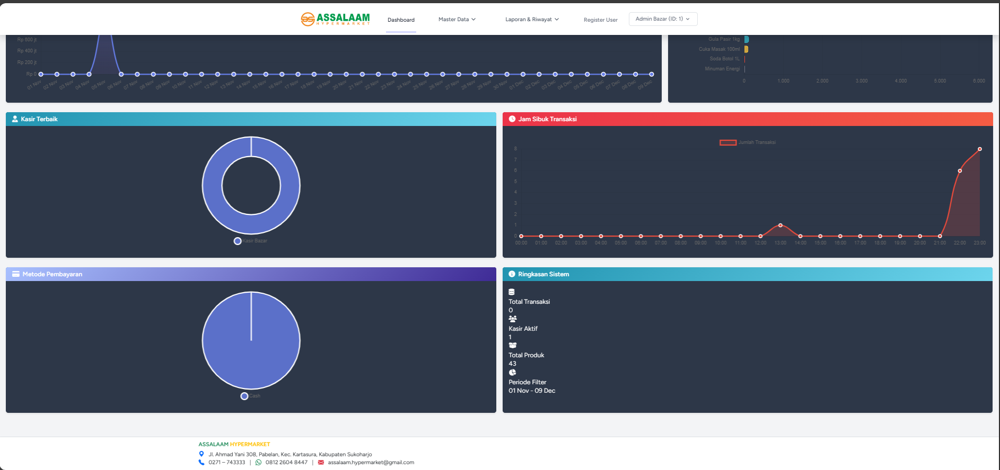
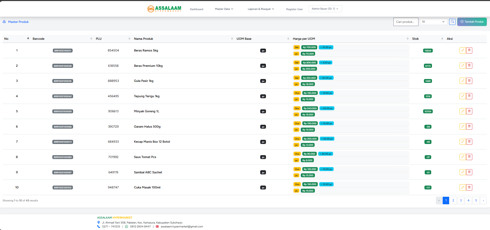
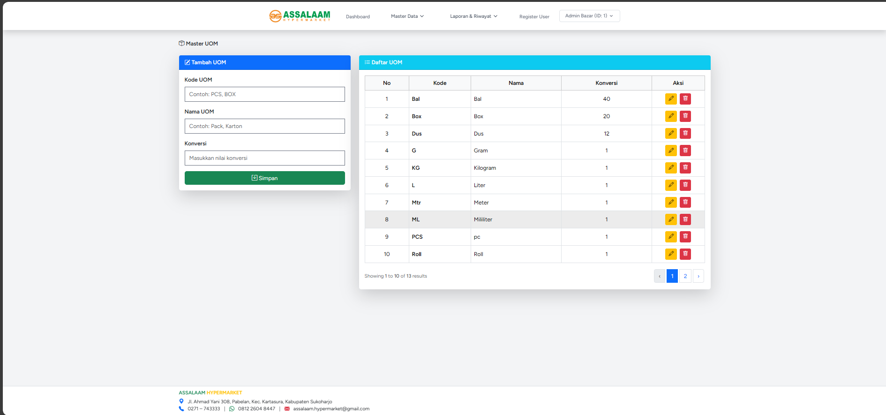
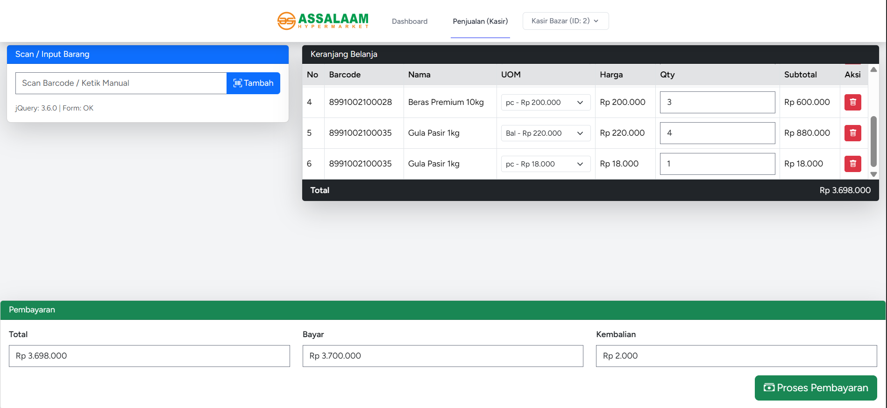
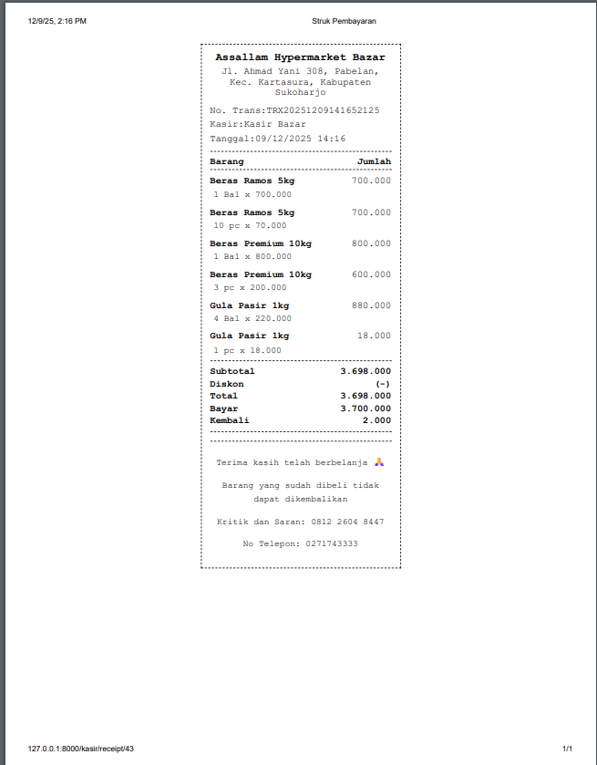
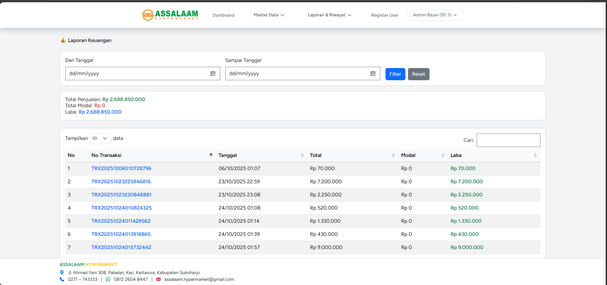

## Sistem Point Off Sales Berbasis WEB

Sistem ini saya kembangkan untuk project laporan magang saya karena saya sudah bekerja di hypermarket tersebut sudah 3 tahun dan menemukan
case yang belom ada sistem nya maka saya buat sistem POS berbasis web untuk event bazar

- Login

- Dashboard

- Master Produk

- Master Uom

- Kasir

- Struk

- Laporan Stok

- Laporan Keuangan

- Laporan Transaksi

